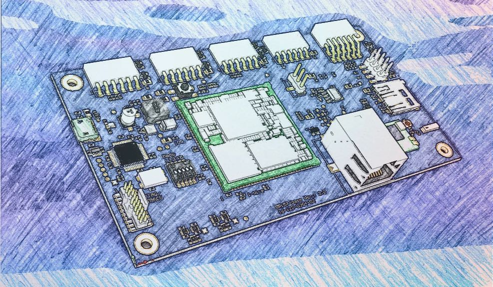

# GRiSP 2 Support

[](https://circleci.com/gh/nerves-project/nerves_system_grisp2)[](https://hex.pm/packages/nerves_system_grisp2)

This might be the base Nerves System configuration for the [GRiSP
2](http://grisp.org/).

*This is a work in progress. It may change in backwards incompatible ways and the documentation might be lacking.*

To do:

- [x] Bring up Ethernet
- [x] Bring up WiFi
- [x] Verify RGB LEDs
- [ ] Verify DIP switches
- [ ] Enable 1-Wire and test
- [ ] Verify SPI
- [x] Verify MicroSD card works
- [ ] Verify ATECC608B
- [ ] Verify HW watchdog
- [x] Add ramoops support
- [ ] Review GRiSP2 specs to see what else there is to verify
- [x] Check that `TARGET_GCC_FLAGS` are right
- [x] Update Linux kernel to 5.10
- [x] Update Nerves Toolchain 1.5.0 version
- [x] Implement A/B firmware updates work
- [x] Create example app that uses GRiSP2. See Circuits Quickstart and Nerves Livebook
- [x] Review Linux kernel options and compare with other systems
- [ ] Clean up debug and low hanging items to improve boot time
- [ ] Clean up changes to GRiSP repositories and send PRs
- [x] Use GRiSP serial number in hostname



| Feature              | Description                     |
| -------------------- | ------------------------------- |
| CPU                  | NXP iMX6ULL, ARM Cortex-A7 @ 696 MHz |
| Memory               | 512 MB DRAM                     |
| Storage              | 4 GB eMMC and optional MicroSD  |
| Linux kernel         | 5.15 w/ Phytec patches          |
| IEx terminal         | ttymxc0                         |
| GPIO, I2C, SPI       | Yes - [Elixir Circuits](https://github.com/elixir-circuits) |
| LEDs                 | Yes - named `red:indicator-1`, etc. in `sys/class/leds` |
| ADC                  | -                               |
| PWM                  | -                               |
| UART                 | ttymxc0-ttymxc5                 |
| Camera               | None                            |
| Ethernet             | Yes                             |
| WiFi                 | Yes - 2.4GHz station mode (no Soft-AP) (R8188EU) |
| HW Watchdog          | i.MX6 watchdog enabled on boot  |

## Using

The most common way of using this Nerves System is create a project with `mix
nerves.new` and to export `MIX_TARGET=grisp2`. See the [Getting started
guide](https://hexdocs.pm/nerves/getting-started.html#creating-a-new-nerves-app)
for more information.

If you need custom modifications to this system for your device, clone this
repository and update as described in [Making custom
systems](https://hexdocs.pm/nerves/systems.html#customizing-your-own-nerves-system)

## Boot notes

This system isn't ready for general use. If you know how to build a Nerves
system, then it will probably be a little frustrating, but you'll get something
to boot.

1. Build the system
2. Create a test Nerves project or try `circuits_quickstart` to use it.
3. Build the project with `mix firmware`. Then run `mix firmware.image` to get
   an image file.
4. gzip the image file and copy to a FAT-formatted MicroSD card.
6. Connect the GRiSP2's USB port to your computer and open up a terminal session
   (115200 8N1).
7. Boot the GRiSP2 and press a key to break into the bootloader.
8. Run:

    ```
    uncompress /mnt/mmc/myfirmware.img.gz /dev/mmc1
    reset
    ```
9. Now you should be able to use `mix upload` or `./upload.sh` for subsequent
   updates. The firmware is set to auto-validate.

## Console access

GRISP2 will create two virtual UART ports when plugged in. The second of these will contain a system console where you can interact with BareBox and the Elixir Shell.
On Linux, this looks like:

```
/dev/ttyUSB0
/dev/ttyUSB1
```

You can connect via `picocom` with:

```
picocom /dev/ttyUSB1 115200
```

>NOTE: This differs from the Official GRISP2 guide in that we don't need the `--echo` flag.

## PMOD usage

The GRiSP 2 has five PMOD interfaces. GPIO pins should all be accessible. Pins
for other functions are configured for those functions:

* UART PMOD - access the UART pins via `ttymcx3`
* I2C PMOD - access I2C via `i2c-1`
* SPI1 PMOD - access SPI via `spidev0.0`
* SPI2 PMOD - access SPI via `spidev0.1`

## Provisioning devices

TODO: The GRiSP 2 includes an ATECC608A so provisioning the board for use with
NervesHub can be done without setting U-Boot environment variables.

## Linux versions

*TBD*

We're currently using PHYTEC's Linux kernel fork from
[git.phytec.de/linux-mainline](git://git.phytec.de/linux-mainline).
